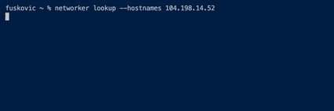
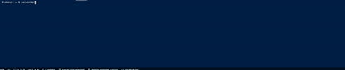
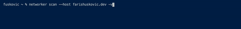

# Networker

A practical CLI tool for network administration.

# Installation

    go get -u github.com/fuskovic/networker

# Commands

## List

    networker list

## Lookup

    networker lookup --hostnames 104.198.14.52
    networker lookup --network farishuskovic.dev
    networker lookup --nameservers farishuskovic.dev
    networker lookup --addresses farishuskovic.dev

## Request

    networker request --url https://api.thecatapi.com/v1/breeds

## Scan

    networker scan --host farishuskovic.dev

## Capture

    networker capture -d en0 -s 10

